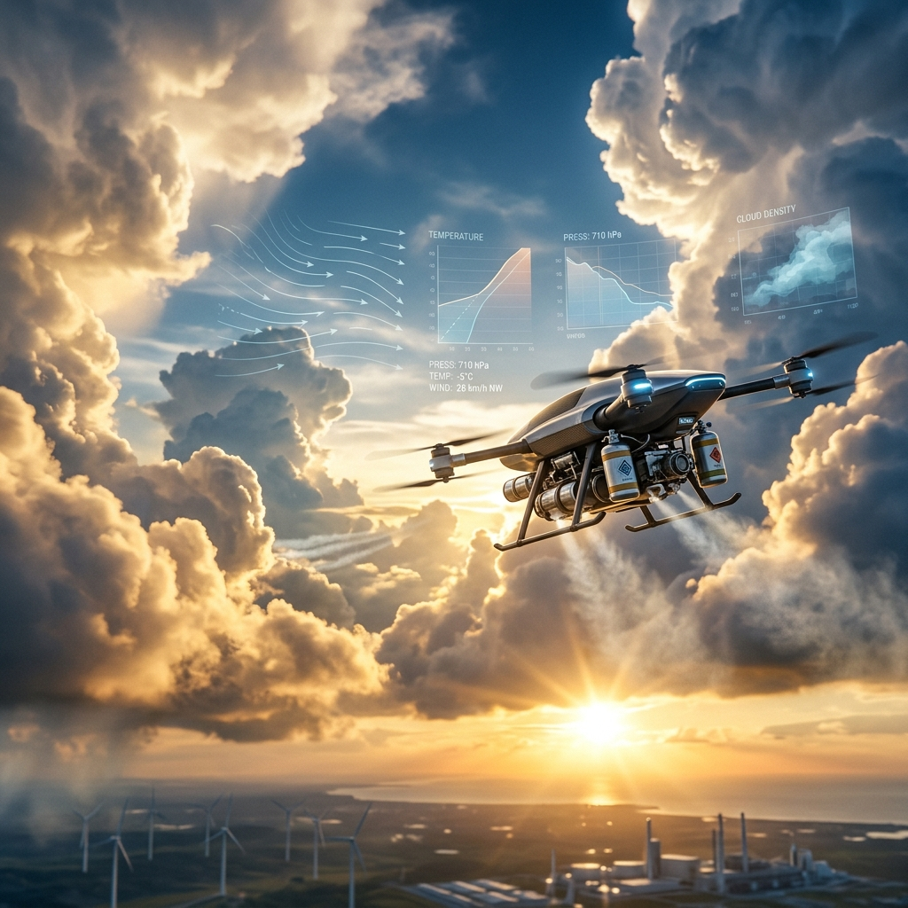

  
   
  <h1>🚀 Aero-Climate Engineering</h1>
  
<strong>Açık kaynaklı hava durumu modifikasyonu, otonom bulut tohumlama ve uçta yapay zeka (Edge AI) destekli atmosferik kontrol sistemleri mimarisi.</strong>

  

    
    
    
    
  

---

## 🌩️ Vizyon: Bulutları Dijitalleştirmek (Digitizing the Clouds)

**Aero-Climate Engineering**, iklim değişikliği ile mücadelede pasif değil, aktif bir rol üstlenmek amacıyla başlatılmıştır. Su kıtlığı ve düzensiz yağış rejimleri, küresel gıdaya erişim ve ekosistem sürdürülebilirliği üzerinde kritik tehditler oluşturmaktadır. Geleneksel bulut tohumlama yöntemleri; yüksek maliyetli insanlı uçuşlar, düşük hedefleme hassasiyeti ve gerçek zamanlı veri eksikliği nedeniyle verimlilikten uzaktır.

Bu proje, **Otonom İHA'lar**, **Uçta Yapay Zeka (Edge AI)** ve **Dağıtık IoT Sensör Ağları**'nı bir araya getirerek atmosferik müdahaleyi bir "hassas tarım" disiplinine dönüştürmeyi hedefler. Amacımız; doğru zamanda, doğru buluta, doğru miktarda tohumlama ajanı bırakarak yağış verimini maksimize etmektir.

---

## 🏗️ Teknolojik Katmanlar ve Ekosistem

Proje, birbirine bağlı 4 derin katman üzerine inşa edilmiştir:

### 1. [`hardware/`](./hardware/) - Otonom Sistemler ve Fiziksel Müdahale
Atmosferik müdahalenin "kasları".
- **İHA Mimarisi:** Yüksek irtifa rüzgarlarına ve cumulus bulutu içindeki türbülansa dayanıklı, karbon fiber ağır yük platformları.
- **Tohumlama Payloadu:** Gümüş İyodür (AgI) veya Higroskopik Tuzlar için servo-kontrollü, hassas salınım yapan kapsül sistemleri ([bkz: `payload_control/`](./hardware/payload_control/)).

### 2. [`edge-ai/`](./edge-ai/) - Atmosferik Zeka (The Brain)
Bulutun içinde, milisaniyeler bazında karar veren yapay zeka.
- **Cloud-Vision (TFLite):** Drone üzerindeki kameradan gelen görüntüyü saniyede 30+ kare hızında işleyerek bulut türünü, yoğunluğunu ve tohumlama potansiyelini analiz eder.
- **Otonom Hedefleme:** Sensör füzyonu ile rüzgar vektörlerini hesaplayıp ajanın salınacağı en optimum koordinatı belirler.

### 3. [`telemetry/`](./telemetry/) & [`iot/`](./iot/) - Veri Ağı (The Nervous System)
Yer ve gök arasındaki kesintisiz iletişim.
- **Dağıtık Sensörler:** Toprak neminden bulut içi neme kadar her şeyi ölçen LoRaWAN tabanlı düğümler.
- **MQTT Telemetri:** Her dronun uçuş telemetrisini ve atmosferik profilini komuta merkezine eş zamanlı iletir.

### 4. [`monitoring/`](./monitoring/) - Operasyonel İzleme (The Command Center)
Veriyi operasyonel karara dönüştüren merkez.
- **[Prometheus & Grafana](./monitoring/):** Tüm sistem sağlığını, tohumlama başarısını ve atmosferik değişimleri canlı olarak görselleştirir.

---

## ⚙️ Operasyonel İş Akışı (Operational Life-Cycle)

1.  **Keşif:** Meteorolojik modeller ve yer sensörleri tohumlamaya uygun bulut oluşumlarını belirler.
2.  **Konuşlanma:** Otonom İHA filosu hedef bölgeye sevk edilir.
3.  **Uçta Analiz:** İHA, **Edge AI** ile bulutun iç sıcaklığını ve nemini ölçerek tohumlama için "Sweet Spot" (En Optimum Nokta) tespiti yapar.
4.  **Müdahale:** Hassas salınım sistemi, tohumlama ajanını (AgI) bulutun yükselen hava akımına bırakır.
5.  **Doğrulama:** Yer istasyonları ve radar verileri ile yağışın başarısı ölçülür ve yapay zeka modeli "Closed-Loop" (Kapalı Döngü) şeklinde kendini eğitir.

---

## 🔬 Bilimsel İnceleme: Bulut Tohumlama Nedir? (The Physics)

Bulut tohumlama, bulutlardaki su damlacıklarının kristalleşmesini tetikleme sürecidir.
*   **Soğuk Bulut Tohumlama (AgI):** Gümüş İyodür kristalleri, buz kristallerine benzer bir yapıya sahiptir. Süper soğumuş su damlacıkları bu kristallerin etrafında toplanarak donar ve ağırlaşarak yağış olarak düşer.
*   **Higroskopik Tohumlama (Sıvı/Tuz):** Sıcak bulutlarda, suyu kendine çeken tuz kristalleri püskürtülerek damlacıkların birbirine çarpıp büyümesi (coalescence) tetiklenir.

---

## ⚖️ Etik ve Jeo-mühendislik (Geo-Ethics)

"Bulutu çalmak su savaşlarına yol açar mı?" Aero-Climate Engineering bu soruyu ciddiye alır.
- **Sürdürülebilirlik:** Müdahaleler ekolojik dengeyi bozmayacak miktarda ve şeffaf bir şekilde yapılmalıdır.
- **Şeffaflık:** Tüm operasyonlar açık kaynaklı veri ağları üzerinden izlenebilir olmalıdır.
- **Uluslararası Hukuk:** Sınır aşan su kaynakları ve hava sahası egemenliği ilkeleri, projenin etik manifestosunun temelidir.

---

## 🗺️ Gelecek Yol Haritası (Roadmap 2026-2027)

- [ ] **Q3 2026:** Edge AI bulut sınıflandırma doğruluğunun %95 üzerine çıkarılması.
- [ ] **Q4 2026:** Multi-UAV Swarm (Sürü İHA) ile koordineli tohumlama algoritmaları.
- [ ] **Q1 2027:** Mobil yer istasyonu konteyner mimarisinin tamamlanması.
- [ ] **Q2 2027:** İlk geniş ölçekli otonom saha testleri ve veri yayını.

---

## 📚 Teknik Derin İncelemeler (Technical Deep Dives)

Bu projenin arkasındaki mühendislik ve bilimsel detayları daha derinden incelemek isterseniz, aşağıdaki teknik beyaz kitaplarımıza göz atabilirsiniz:

*   **[İklim Mühendisliği ve Bulut Mikro-Fiziği](./docs/Deep_Dive_Atmospheric_Physics.md)**: WBF süreci, buz çekirdeklenmesi ve AgI kinetiği üzerine akademik bir bakış.
*   **[Otonom İHA Mühendisliği ve Kontrol Kuramı](./docs/Deep_Dive_UAV_Engineering.md)**: Türbülans altındaki EKF (Kalman Filtreleri), anti-icing sistemleri ve sürü algoritmaları.
*   **[Uçta Yapay Zeka ve Bilgisayarlı Görü](./docs/Deep_Dive_Edge_AI.md)**: Model kuantizasyonu, morfolojik bulut analizi ve olasılıksal tetikleme mantığı.

---
*Bu proje, otonom sistemler ve ileri teknoloji optimizasyonları üzerine çalışan **Meta-Engineering Research Lab** bünyesinde açık kaynak topluluğu için başlatılmıştır.*
